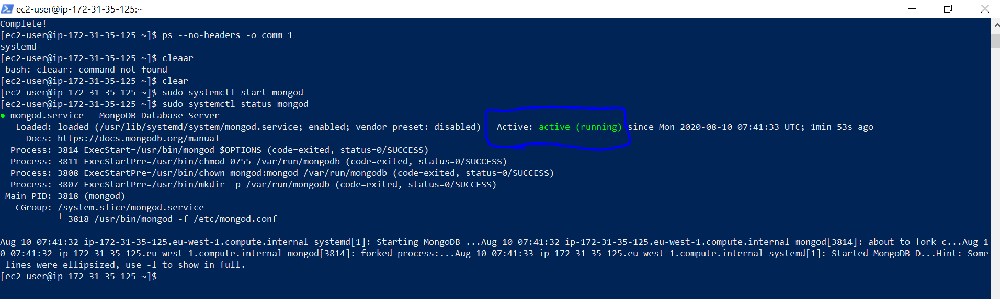
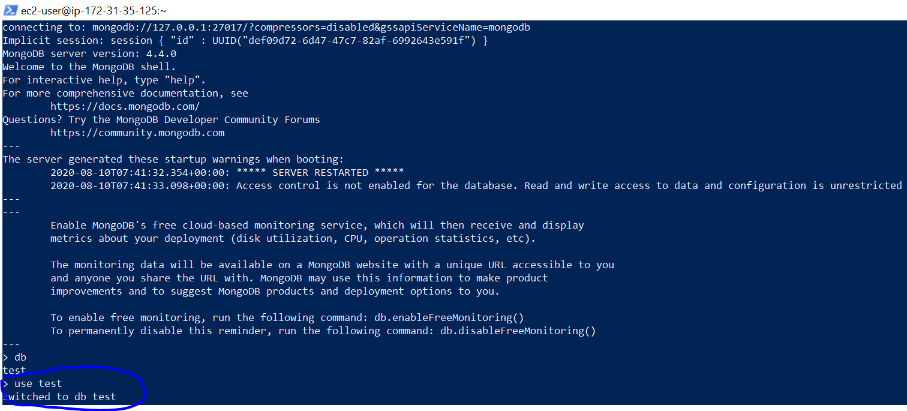

# MongoDB


## How to provision EC2 instance with MongoDB - NoSql

##  clone git repo:
```
module "mongoDb" {
    source = "git::https://github.com/yogmangela/terra-modules//ec2"
    access_key =     //"your access_key"
    secret_key =    // "your secret_key"
    key_name= // your pem key name wich is already in your accout /region
    security_groups= // security Group which is provided as a list i.e ["HTTPS-ONLY"]
    ami="ami-07d9160fa81ccffb5"
}
```
- provide your access_key, secrete_Key, Key_Name,  security_groups

- NOTE : This is not a best practise exposing Access_key and Secrete_key, this is just for a demo purpose. Use AWS Secreates manager / ENV / Terraform Hashi Valut to encrypt your secreate.

## once prvisioned SSH into EC2 instance

- run below command to install MongoDB:

```

sudo yum update -y

sudo -i

```
## follow this link to install mongoDB:
https://docs.mongodb.com/manual/tutorial/install-mongodb-on-amazon/

or follow below:

## create a file: /etc/yum.repos.d/mongodb-org-4.4.repo
```
vi /etc/yum.repos.d/mongodb-org-4.4.repo
```

## copy and paste:

```
[mongodb-org-4.4]
name=MongoDB Repository
baseurl=https://repo.mongodb.org/yum/amazon/2/mongodb-org/4.4/x86_64/
gpgcheck=1
enabled=1
gpgkey=https://www.mongodb.org/static/pgp/server-4.4.asc
```

once copied and pasted press ESc key and type: 
```
:wq!
```
it is to write and save and exit file:

## update yum repo again 

```
sudo yum update
```

##  Install MongoDB

```
sudo yum install -y mongodb-org
```

## check to see which system you platform uses:
systemd OR init

``
ps --no-headers -o comm 1
``
## start mongoDB service by

``
sudo systemctl start mongod
``
## if above fails 

``
sudo systemctl daemon-reload
``

## check mongoDB status:

``
sudo systemctl status mongod
``


## To beging using mongoDB run below command

``
mongo
``


